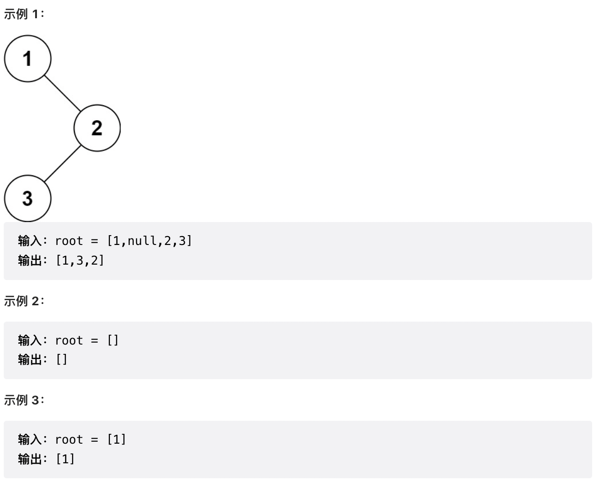

# 94. 二叉树的中序遍历

给定一个二叉树的根节点 root ，返回 它的 中序 遍历 。



## 解题思路1: 使用递归的方法 - 中序遍历是指先遍历二叉树的左节点，在遍历中间节点，最后遍历右节点

什么是中序遍历：先遍历左节点，在遍历根节点，在遍历右节点

时间复杂度：O(n) 空间复杂度：O(n)

```js
/**
 * Definition for a binary tree node.
 * function TreeNode(val, left, right) {
 *     this.val = (val===undefined ? 0 : val)
 *     this.left = (left===undefined ? null : left)
 *     this.right = (right===undefined ? null : right)
 * }
 */
/**
 * @param {TreeNode} root
 * @return {number[]}
 */
var inorderTraversal = function(root) {
   let res = []
   const inorder = root => {
        if(!root) return
        inorder(root.left)
        res.push(root.val)
        inorder(root.right)
   }
   inorder(root)
   return res
};
```

## 解题思路2: Morris 遍历算法 - 指针指向

Morris 遍历算法整体步骤如下（假设当前遍历到的节点为 xx）：

1. 如果 xx 无左孩子，先将 xx 的值加入答案数组，再访问 xx 的右孩子，即 x = x.right
2. 如果 xx 有左孩子，则找到 xx 左子树上最右的节点（即左子树中序遍历的最后一个节点，xx 在中序遍历中的前驱节点），我们记为 p。根据 p 的右孩子是否为空，进行如下操作。
   + 如果 p 的右孩子为空，则将其右孩子指向 xx，然后访问 xx 的左孩子，即 x = x.left
   + 如果 p 的右孩子不为空，则此时其右孩子指向 xx，说明我们已经遍历完 xx 左子树，我们将 p 的右孩子置空，将 xx 的值加入答案数组，然后访问 xx 的右孩子，即 x = x.right
3. 重复上述操作，直至访问完整棵树。

拿示例举例：

1. 第一次： root = 1  p = root.left = 2  while循环p = 5  5.right = 1  root = 2
2. 第二次： root = 2 p = root.left = 4   while循环p = 4  4.right = 2 root = 4
3. 第三次： root = 4  直接push进res = [4] root = root.right = 2
4. 第四次： root = 2  p = 4 4.right = 2while循环不走了，直接走进else的循环 res = [4,2], 断开p = 4，root = 2之间的链接，也就是左子树断开，root = 5
   
时间复杂度：O(n) 空间复杂度：O(1)

```js
/**
 * Definition for a binary tree node.
 * function TreeNode(val, left, right) {
 *     this.val = (val===undefined ? 0 : val)
 *     this.left = (left===undefined ? null : left)
 *     this.right = (right===undefined ? null : right)
 * }
 */
/**
 * @param {TreeNode} root
 * @return {number[]}
 */
var inorderTraversal = function(root) {
   let res = []
   let p = null
   while(root) {
       if(root.left) {
            p = root.left // p指向树的左节点
            // p节点就是当前 root 节点向左走一步，然后一直向右走至无法走为止(找到一棵树左子树的最右边的节点开始)
            while(p.right && p.right !== root) {
               p = p.right
            }
            // 如果节点没有右子树，那就将节点的右节点指向root（父亲）
            if(!p.right) {
                p.right = root
                root = root.left
            } else { // 如果节点有右子树（是上面的条件我们自己构造的），说明左子树已经访问完了，我们需要断开链接
                res.push(root.val)
                p.right = null
                root = root.right
            }
       } else { // 如果没有左孩子，则直接访问右孩子
           res.push(root.val)
           root = root.right
       }
   }
   return res
};
```